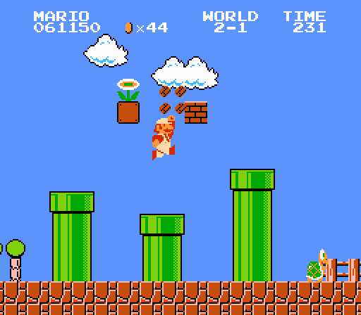
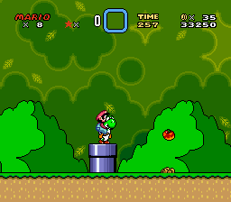
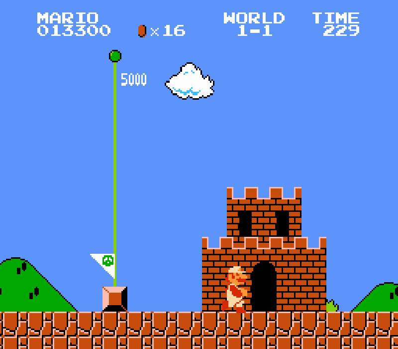

# [fit] Leveling Up with Pipelines



---

## [fit] What are Pipelines?

^ You've probably already used pipelines

---

### Quick Example

`cat logs.txt | grep “ERROR” | wc -l`

^ Get the contents of the logs file, search errors, and count them

^ You just created a pipeline!

---

## Benefits of Pipelines

[.build-lists: true]

* Divides your app into small chunks
* Stages executed in series
* Stages can be reused in different pipelines
* Adds readability
* Stages follow SRP
* Smaller, more testable code

^ With pipelines, you divide your app into small chunks called "stages"

^ The output of a stage is piped into the next stage

---



^ So let's get started

---


## [fit] Examples

---

### [fit] Middleware

---

### Laravel

^ Define the pipeline

```php
// Within App\Http\Kernel Class...

protected $routeMiddleware = [
    'auth' => \Illuminate\Auth\Middleware\Authenticate::class,
    'auth.basic' => \Illuminate\Auth\Middleware\AuthenticateWithBasicAuth::class,
    'bindings' => \Illuminate\Routing\Middleware\SubstituteBindings::class,
    'can' => \Illuminate\Auth\Middleware\Authorize::class,
    'guest' => \App\Http\Middleware\RedirectIfAuthenticated::class,
    'throttle' => \Illuminate\Routing\Middleware\ThrottleRequests::class,
];
```

---

### Laravel

```php
class CheckAge
{
    public function handle($request, Closure $next)
    {
        if ($request->age <= 200) {
            return redirect('home');
        }

        return $next($request);
    }
}
```

---

### [fit] eCommerce

---

### eCommerce

```php
$order = new Order;
```

---

### eCommerce

```php
$order = new Order;

$paymentPipeline = (new Pipeline)
    ->pipe(new ApplyCoupons)
    ->pipe(new ApplyTaxes)
    ->pipe(new AddShipping)
    ->pipe(new ProcessPayment);
```

---

### eCommerce

```php
$order = new Order;

$paymentPipeline = (new Pipeline)
    ->pipe(new ApplyCoupons)
    ->pipe(new ApplyTaxes)
    ->pipe(new AddShipping)
    ->pipe(new ProcessPayment);

$orderPipeline = (new Pipeline)
    ->pipe(new CreateOrder)
    ->pipe($paymentPipeline)
    ->pipe(new SendInvoice);

$orderPipeline->process($order);
```

---

### [fit] Notifications

^ Pipelines are just a collection of sequential operations

^ Stages can build on and manipulate the payload, or they can just act on it

---

### Notifications

```php
$notification = new Notification;

$notificationPipeline = (new Pipeline)
    ->pipe(new Notifications\Web)
    ->pipe(new Notifications\Mobile)
    ->pipe(new Notifications\Email);

$notificationPipeline->process($notification);
```

---

### [fit] Refactoring

---

#### Before

```php
// Get Latest Activity (email events, associated engagements)
if ($this->shouldFetchRelatedDataType(SomeFakeCrmApp::KEY_LATEST_ACTIVITY, $objectType)) {
    $activityPromises = [
        'engagements' => $this->provider->getAssociatedEngagementsForObject($objectType, $objectId)
    ];

    $activityPromise = \GuzzleHttp\Promise\all($activityPromises)->then(function(array $responses){
        return new FulfilledPromise($this->zipAndSortLatestActivity($responses));
    });

    $promises[SomeFakeCrmApp::KEY_LATEST_ACTIVITY] = $activityPromise;
}

// Get Lists
if ($this->shouldFetchRelatedDataType(SomeFakeCrmApp::KEY_LISTS, $objectType)) {
    $promises[SomeFakeCrmApp::KEY_LISTS] = $this->provider->getLists(
        array_pluck(array_get($profile, 'lists', []), 'static-list-id')
    );
}

// Get Workflows
if ($this->shouldFetchRelatedDataType(SomeFakeCrmApp::KEY_WORKFLOWS, $objectType)) {
    $promises[SomeFakeCrmApp::KEY_WORKFLOWS] = $this->provider->getWorkflowsForContact($objectId);
}

// Get Deals
if ($this->shouldFetchRelatedDataType(SomeFakeCrmApp::KEY_DEALS, $objectType)) {
    $promises[SomeFakeCrmApp::KEY_DEALS] = $this->provider->getDealsForObject($objectType, $objectId);
}

return \GuzzleHttp\Promise\unwrap($promises);
```

---

#### After

```php
$relatedDataPipeline = new RelatedDataPipeline(
    $this->provider,
    $profile
);

return $relatedDataPipeline->processPipeline();
```

---

#### After - Builder

```php
$stages = [
    SomeFakeCrmApp::KEY_LATEST_ACTIVITY  => LatestActivityPipeline::class,
    SomeFakeCrmApp::KEY_LIST_MEMBERSHIPS => ListsStage::class,
    SomeFakeCrmApp::KEY_WORKFLOWS        => WorkflowsStage::class,
    SomeFakeCrmApp::KEY_DEALS            => DealsStage::class,
];

function buildPipeline() {
    $builder = new PipelineBuilder;

    foreach ($this->stages as $stageKey => $stage) {
        if ($this->shouldAddStage($stageKey) === false) {
            continue;
        }

        $builder->add(new $stage);
    }

    $this->pipeline = $builder->build();
}

function processPipeline(): array {
    $promises = $this->pipeline->process([]);
    return \GuzzleHttp\Promise\unwrap($promises);
}
```

^ "should add stage" determined by which pieces the user selected and whether the API has granted the appropriate scopes

^ Not only can you reuse stages, but you can reuse pipelines as well

---

### Reusing Pipelines

```php
class LatestActivityPipeline {
    protected $stages = [
        AssociatedEngagementsStage::class,
        EmailEventsStage::class
    ];
}
```

---

### Bonus refactor!

```php
function buildPipeline() {
    $stages = collect($this->stages)
        ->filter(function($stage, $stageKey){
            return $this->shouldAddStage($stageKey);
        })
        ->map(function($stage){
            return new $stage;
        })
        ->toArray();

    $this->pipeline = new Pipeline($stages);
}
```

---

### Benefits - a recap

[.build-lists: true]

* Smaller, more managable stages
* Reusable stages
* Increased readability
* Better testing!

---

### Thanks!



---

### References

* [Design Pattern: the Pipeline](https://doanduyhai.wordpress.com/2012/07/08/design-pattern-the-pipeline/)
* [The Pipeline Pattern — for fun and profit](https://medium.com/@aaronweatherall/the-pipeline-pattern-for-fun-and-profit-9b5f43a98130)
* [How to use the Pipeline Design Pattern in Laravel](http://culttt.com/2015/09/28/how-to-use-the-pipeline-design-pattern-in-laravel/)
* [League\Pipeline](http://pipeline.thephpleague.com/)